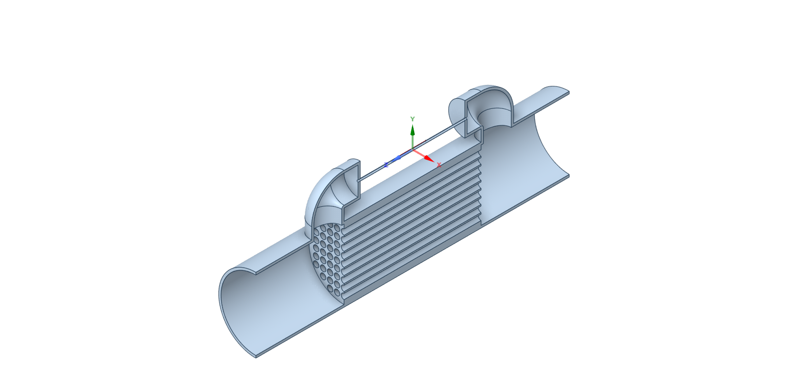
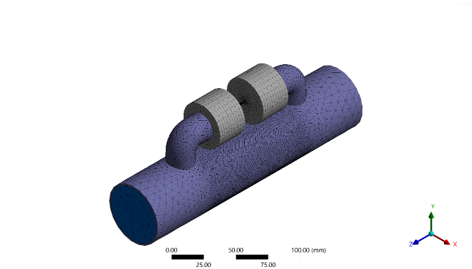
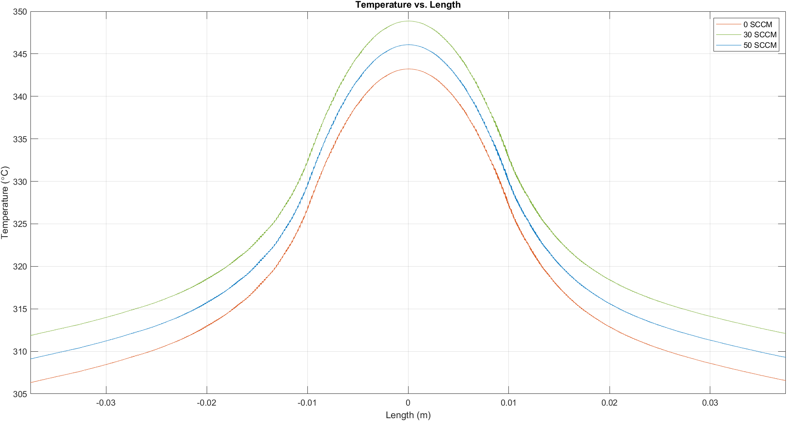
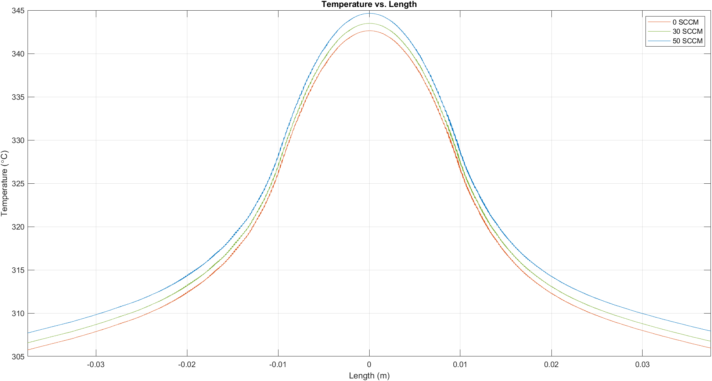
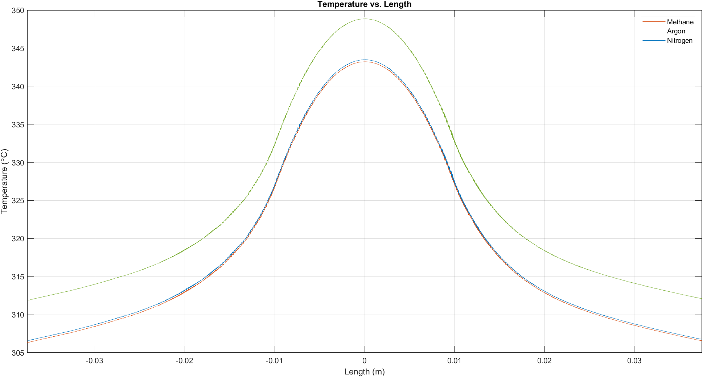

# CFD-based method to measure Nusselt Number in a Thermal Capillary Mass Flowmeter

## Project Overview
A computational fluid dynamics (CFD) study to simulate and analyze heat transfer characteristics in a thermal capillary mass flowmeter. The project demonstrates a novel method for measuring the Nusselt number using ANSYS Fluent simulation, validated against literature data.

---

## Abstract

This project uses a CFD-based method for measuring the Nusselt number in thermal capillary mass flowmeters. Traditional experimental techniques for Nusselt number measurement involve complex physical setups. Here I have leveraged ANSYS Fluent to provide detailed insights into temperature distribution, heat transfer characteristics, and flow behavior that are difficult to obtain experimentally via relatively easier CFD methods.

The thermal capillary mass flowmeter operates by measuring the thermal response of fluid within a capillary tube under controlled flow conditions. By analyzing temperature gradients and mass flow rates, this method offers direct calculation of convective heat transfer coefficient and Nusselt number. By measuring these charactersitics, we can further predict and enhance the flowmeter's ability to accurately measure flow rate.

**Key Advantages of CFD Approach:**
- Simplified analysis of complex phenomena (heat transfer, turbulence)
- Enables rapid testing of multiple configurations
- Provides detailed visualization of flow and thermal fields
- Cost-effective compared to physical experimental setups
- Seamless integration with CAD for simpler and effective design optimization

---

## Background: Thermal Capillary Mass Flowmeters

### Working Principle
Thermal mass flowmeters measure gas flow rates by applying a constant heat flux and measuring the temperature change as heat dissipates into the fluid. The system uses:
- **Constant heat input** to a capillary tube
- **Multiple temperature sensors** positioned symmetrically along the heated section
- **Temperature difference** directly correlates to mass flow rate

### Key Parameters
- **Nusselt Number (Nu)**: Dimensionless quantity representing the ratio of convective to conductive heat transfer
- **Sensitivity**: Critical for measurement accuracy
- **Linear Range**: Temperature difference vs. flow rate relationship


*Schematic of thermal capillary mass flowmeter showing sensor and heater positions*

---

## Methodology

### 1. CAD Modeling (ANSYS SpaceClaim)

**Geometry Specifications:**
| Parameter | Value |
|-----------|-------|
| Inlet/Outlet diameter | 50 mm |
| Sensor tube internal diameter | 1.45 mm |
| Sensor tube length | 75 mm |
| Heater length | 20 mm |
| Heat flux intensity | 500 W/m² |
| Insulator thickness | 19.275 mm |

**Materials:**
- **Walls**: Stainless steel
- **Insulator**: Mineral wool (k = 0.0927 W/m·K)
- **Fluid**: Methane, Argon, Nitrogen (3 different gases were taken for comparison)

**Design Features:**
- Multiple bypass tubes for stable flow distribution
- Symmetrical sensor placement along capillary
- Insulated heating section to minimize heat losses to the surroundings

**Reference:** Dimensions based on M. Farzaneh-Gord et al. (2015) for validation purposes

### 2. Mesh Generation

**Mesh Specifications:**
- High-resolution mesh in capillary and bypass tubes
- Refined mesh near capillary walls and heating element (critical for Nusselt number calculation)
- Boundary layer mesh for accurate wall heat transfer calculation


*3D CAD model showing complete assembly*


*Longitudinal cross-section revealing internal structure*


*Computational mesh generated for CFD analysis*


*High-resolution mesh of fluid domain showing capillary refinement*

### 3. CFD Simulation Setup (ANSYS Fluent)

**Solver Configuration:**
- **Flow Model**: Viscous flow
- **Turbulence Model**: Realizable k-epsilon with enhanced wall treatment (Nusselt number is calculated at the walls)
- **Energy Model**: Enabled for conjugate heat transfer analysis

**Boundary Conditions:**

| Boundary | Type | Value | Notes |
|----------|------|-------|-------|
| Inlet | Velocity inlet | **0, 30, 50 SCCM** | Parametric study |
| Inlet Temperature | Fixed | 300 K | Room temperature |
| Heating Element | Heat flux | 500 W/m² | Constant |
| Outlet | Pressure outlet | Atmospheric | Natural exhaust |
| Walls | No-slip | Coupled | Conjugate heat transfer |
| Insulation | Wall | Adiabatic outer | Minimizes losses |

**Convergence Criteria:**
- Residuals < 10⁻⁶ for energy
- Residuals < 10⁻³ for continuity, momentum
- Typical convergence: ~500 iterations

**Test Matrix:**

| Gas | Flow Rates (SCCM) | Total Cases |
|-----|-------------------|-------------|
| Methane | 0, 30, 50 | 3 |
| Argon | 0, 30, 50 | 3 |
| Nitrogen | 0, 30, 50 | 3 |
| **Total Simulations** | | **9** |

**Methane Properties @ 300K :**
- Specific heat capacity: 2222 J/kg·K
- Density: 0.6679 kg/m³
- Thermal conductivity: 0.0332 W/m·K

**Argon Properties @ 300K :**
- Specific heat capacity: 520.64 J/kg·K
- Density: 1.6228 kg/m³
- Thermal conductivity: 0.0158 W/m·K

**Nitrogen Properties @ 300K):**
- Specific heat capacity: 1040.67 J/kg·K
- Density: 1.138 kg/m³
- Thermal conductivity: 0.0242 W/m·K


**Convergence:** ~500 iterations

---

## Results & Analysis

### Temperature Distribution

Temperature profiles along the flowmeter length were obtained for various flow rates (0, 30, 50 SCCM), different fluids (Methane, Argon, Nitrogen) and validated against literature (M. Farzaneh-Gord et al., 2015).

**Key Observations:**
- Symmetrical temperature distribution around heater
- Maximum temperature near heater center (x = 0)
- Temperature gradient steepness increases with flow rate
- Temperature gradient shifts along the flow for higher flow rates
- Sensor placement at ±20 mm captures optimal temperature difference

#### Temperature Contours - By Gas

**Methane:**


*Temperature contours for Methane at 0, 30, and 50 SCCM*

**Argon:**

*Temperature contours for Argon at various flow rates*

**Nitrogen:**

*Temperature contours for Nitrogen at various flow rates*

#### Temperature Contours - By Flow Rate

**0 SCCM (All Gases):**

*Comparison at zero flow - symmetrical profiles*

**30 SCCM (All Gases):**

*Comparison at 30 SCCM - asymmetric profiles*

**50 SCCM (All Gases):**

*Comparison at 50 SCCM - maximum asymmetry*


---

### Nusselt Number Analysis

**Validation Against Theory:**

For fully developed pipe flow with constant heat flux:
- **Laminar flow (expected)**: Nu = 3.66
- **Turbulent flow**: Nu = 4.36

**Our Results:**
- Nusselt numbers fall within **3.56 - 4.46** range
- Confirms **predominantly laminar flow** in capillary
- Slight variations due to:
  - Developing thermal boundary layer
  - Entrance effects
  - Local flow disturbances
#### Nusselt Number Plots - Methane


*Methane at 0 SCCM*


*Methane at 30 SCCM*


*Methane at 50 SCCM*

#### Nusselt Number Plots - Argon


*Argon at 0 SCCM*


*Argon at 30 SCCM*


*Argon at 50 SCCM*

#### Nusselt Number Plots - Nitrogen


*Nitrogen at 0 SCCM*


*Nitrogen at 30 SCCM*


*Nitrogen at 50 SCCM*


### Validation

Simulation results were compared with:
- Experimental data from M. Farzaneh-Gord et al. (2015)
- Temperature distribution matches published data
- Theoretical correlations for internal flow heat transfer
- Flow regime confirmed as laminar (Re < 2300)
- Nusselt number within theoretical bounds (3.66-4.36)
- Linear ΔT vs. flow rate relationship confirmed

**Result:** Good agreement validates CFD methodology

---

## Conclusions

1. **CFD as Analysis Tool**: Demonstrates effectiveness for analyzing heat transfer in thermal flowmeters, providing insights difficult to obtain experimentally

2. **Nusselt Number Calculation**: Successfully calculated using temperature gradients and flow rates, validating CFD as reliable alternative to experimental methods

3. **Multi-Gas Capability**: Simulation framework supports testing various gases (methane, argon, nitrogen) across flow range (0-50 SCCM)

4. **Design Optimization**: Method enables parametric studies for optimizing flowmeter geometry, materials, and operating conditions

5. **Validation**: Temperature and Nusselt number profiles align with literature, confirming accuracy and reliability

6. **Predictive Modeling**: Integration with Kalman filtering (future work) will enhance noise reduction and prediction capability

7. **Practical Application**: Clear pathway for industrial and research applications in gas flow measurement

---

## Future Work

### Planned Enhancements:
1. **Parametric Studies**
   - Variation of capillary tube length and diameter
   - Optimization of heater dimensions and positioning
   - Testing different insulation materials

2. **Kalman Filter Integration**
   - Implementation of noise reduction algorithms
   - Development of predictive models for flow rate estimation
   - Improvement measurement accuracy

3. **Extended Flow Range Testing**
   - Determination of linear measurement range limits
   - Characterization of nonlinear behavior at extremes
   - Validation across a wider range

4. **Multi-Physics Analysis**
   - Transient thermal response studies
   - Structural-thermal coupling
   - Optimization algorithms

5. **Experimental Validation**
   - Building a physical prototype
   - Comparing CFD predictions with experimental data
   - Calibration procedure testing

---

## Technical Skills Demonstrated

### Software Proficiency:
- **ANSYS SpaceClaim** - 3D CAD modeling
- **ANSYS Fluent** - CFD simulation and analysis
- **Meshing** - High-quality structured/unstructured mesh generation
- **Post-processing** - Data extraction and visualization

### Engineering Knowledge:
- Heat transfer analysis (conduction, convection)
- Fluid mechanics (internal flow, turbulence modeling)
- Dimensionless analysis (Nusselt number, Reynolds number)
- Thermal mass flowmeter principles
- CFD practices (mesh quality, convergence criteria)

### Research Capabilities:
- Literature review and synthesis
- Methodology development
- Result validation and verification
- Technical documentation

---

## Literature References

1. **M. Farzaneh-Gord et al. (2015)** - "Potential use of capillary tube thermal mass flow meters to measure residential natural gas consumption", Journal of Natural Gas Science and Engineering

2. **Kim et al. (2007)** - "Study on the steady-state characteristics of the sensor tube of a thermal mass flow meter", International Journal of Heat and Mass Transfer

3. **Hinkle & Mariano (1991)** - "Towards understanding the fundamental mechanisms and properties of the thermal mass flow controller", J. Vac. Sci. Technol.

4. **Komiya et al. (1988)** - "Characteristics of a thermal gas flowmeter", Review of Scientific Instruments

5. **Huijsing et al. (1988)** - "Thermal Mass Flowmeter", Scientific Instruments

---

## Repository Contents
```
thermal-flowmeter-cfd/
├── README.md (this file)
├── images/
│   ├── schematic-diagram.png
│   ├── cad-isometric.png
│   ├── cad-cross-section.png
│   ├── mesh-overview.png
│   ├── mesh-detail-fluid.png
│   ├── temp-0sccm.png
│   ├── temp-30sccm.png
│   ├── temp-50sccm.png
│   ├── nusselt-0sccm.png
│   ├── nusselt-30sccm.png
│   └── nusselt-50sccm.png
├── documentation/
│   └── project-report.pdf
└── data/
    └── validation-data.xlsx
```

---

*This project demonstrates the application of computational fluid dynamics in thermal flowmeter design and analysis. The methodology and results provide a foundation for further research and industrial applications in precision gas flow measurement.*
